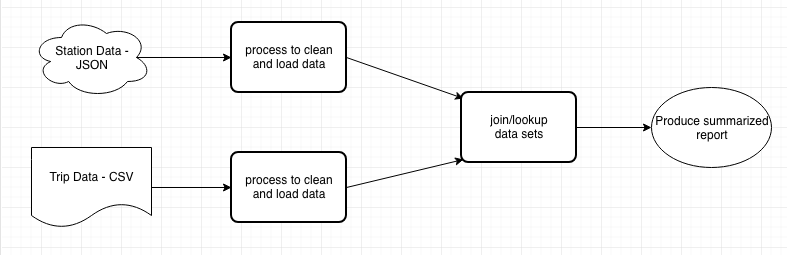

### Divvy Analyze

This is a repo for learning different tools and showcasing some existing skills

#### Getting Started

Data used through out this repo are pulled from two different spots. 

* https://www.divvybikes.com/system-data
    * This data contains basic trip data; starttime, endtime, bikeid, customer type, dob, etc
    * These examples use 2016 Q3 and Q4
    * data was downloaded and stored in this repo for simplicity
* https://feeds.divvybikes.com/stations/stations.json
    * This data is up-to-date from the docking stations around the city
    * Contains points like location, bikes available, docks available, etc

### Overview

I am on planning on 4 different projects. 

* pentaho - complete
* pandas - complete
* aws - complete
* postgresql - complete

I will include a readme in the individual projects. Although the general flow for each is illustrated below:

## Authors

* **Jason J Mathis**  - [Linkedin](https://www.linkedin.com/in/jasonjmathis/)

## Acknowledgments

* Thanks to Divvy for allowing people to download and experiment with their data
* Also sorry I didn't make your data look cooler this is only the beginning!
