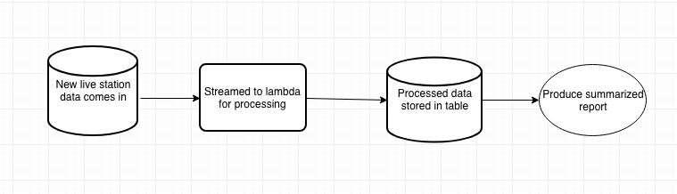

### Divvy Analyze

This example used dynamodb and a lambda function to give yet another example of working with the divvy data. Staying in the AWS free tier had some restrictions I was not anticipating. I encountered numerous error messages; the most prolific being "ProvisionedThroughputExceededException." Nonetheless it was fun to develop and build; the end result was a small poc that could be built upon and used at scale. 
   

#### Part 1 - data loading

The data loading consisted of static data from compressed CSV files and live JSON data from a web endpoint. 
##### StationData

The live station data was simple and straight forward although there are only 600 stations and hence only that many rows to load. There was one small issues noted below about data types. 

##### TripData

The trip data is much more but by no means large. Its static and pulled from compressed CSV files. Getting the data started had some challenges but was not difficult. The main issue here was speed. I needed to load about 300MB of data (about 2 million rows), this would take days to complete. It was a scenario where you would need to scale up the provisioned throughputs for the load but I did not want to be hit with unexpected costs. At 5 provisioned throughputs you are only going to get 5 rows per second and would take about 4-5 days to load the data. I settled on kicking that up to 10 throughputs and loading a sample of the data to work with. 
 
#### Part 2 - reporting

Dynamodb does not support joining, it doesnt have an aggregate framework, it cannot be queried on the anything beside the primary key, unless an secondary index exists. You need to model your data to fit these restrictions in order to reap the benefits of dynamodb. Although for this example I did not change the model and used it as it. The data is structured and relational. In order to do an aggregations I created a lambda function to process data in a streaming fashion as the live station data is loaded into the system. The results were loaded into another table for easy reporting.


#### Data flow

Tables:
* StationData - Live data from the web endpoint.
* TripData - Static data from a zipped CSV file, about 300MB but was sampled down
* FromStationCounts - Aggregation of from_station_id in TripData

Lambda:
* There is a lambda that exists on the StationData table. When that table is reloaded the lambda kicks off and queries the TripData via a secondary index and writes the count of items into the FromStationCounts table.  

 

#### Setup

* main.py # this is the main program
* lambda.py # processes incoming records on the StationData table

I used pipenv for this project. The following snippets can get this started

```python
pip install pipenv #install pipenv if you don't have it
pipenv install #install packages from the Pipfile
pipenv shell #activate the pipenv shell
```

#### Issues


* First issue I hit was dynamodb throwing an error about a [float](https://github.com/j8mathis/divvy_analyze/blob/master/aws/utils.py#L31). The fix was a simple cast and the load continued. 
* Next issue was, I can't [load an empty string](https://githu.com/j8mathis/divvy_analyze/blob/master/aws/utils.py#L101) into dynamodb. I was surprised by this error but was able to work around it.
* I configured the tables with 5 and then 10 [provisionedthroughputs](https://github.com/j8mathis/divvy_analyze/blob/master/aws/utils.py#L134). I can't tell you how many times I received the "ProvisionedThroughputExceededException" error. The lambda calls hit this limitation the most. I suppose you could try throttling them, using a similar [chunking](https://github.com/j8mathis/divvy_analyze/blob/master/aws/utils.py#L46) method from the loading part. 


