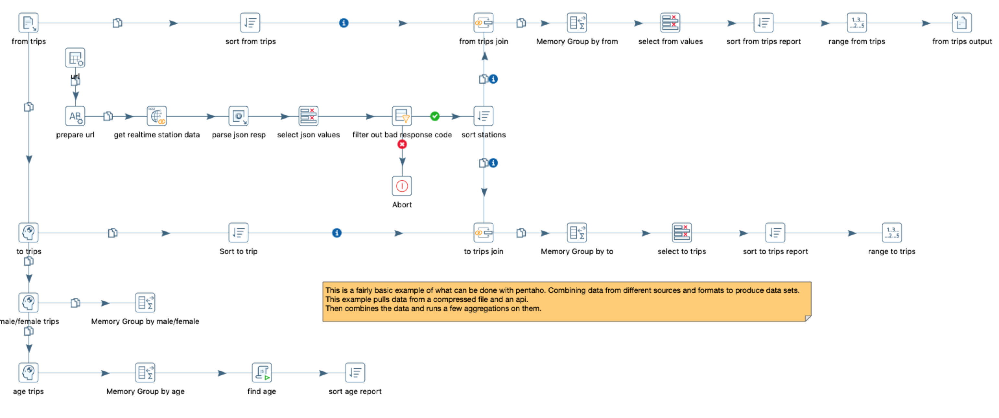

### Pentaho Divvy Example

### What are ktr files? 
.ktr files are pentaho data integration (kettle) files. The platform can be downloaded [here](https://sourceforge.net/projects/pentaho/files/Data%20Integration)

Below is a screenshot to show the tool. 

### Names
This tool can be referred to as the following:
* Pentaho
* PDI
* Kettle
* Data Integration
* Spoon

### What can kettle do?
Kettle is a fantastic tool for pulling different data sources and performing analysis. Although a drag and drop tool it still has a decent learning curve. Kettle has the idea of jobs and transformations. You can create several different transformations and use a job to call each one in a particular order; similar to a main function. Transformations run all the steps in parallel, so there is no guarantee one step will complete before another. Things such as setting variables would need to be set in a previous transformation and passed in at runtime. 

The options, connectors, and tools seem endless. There are connectors to a wide range of data sources. Tools for sorting, ranking, filtering, aggregating, reading and writing files. There are tools where you can even write java, javascript, or python code. Finally there is an option to create a cluster to run transformations distributed across worker nodes. Pretty neat isn't it? 

### Use cases
Pentaho has a large community although it doesn't have the base of other popular coding languages. Cross functional teams would benefit the most from this type of tool. If your day to day tasks change quite a bit and you only occasionally use code for data analysis, pentaho can be a great fit for you and your team. 